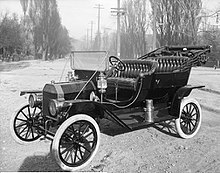

# Stats and Data Science 

## The parable of the highway.

(ref:street-1936-cap) Urban driving in 1936.

```{r street-1936, echo=FALSE, fig.cap = "(ref:street-1936-cap)", out.width="60%"}
knitr::include_graphics("images/street-scene-1936.jpg")
```

Statistics and automobiles have timelines that overlap nicely:

Statistics   |  Automobiles
-------------|-------------
1888 Francis Galton introduces the "co-relation" coefficient | 1885 Karl Benz designs 4-stroke engine for use in his automobile
 | 
1908 William Gossett's t statistic | 1908 First Model T off Henry Ford's production line
 | 
1925 ANOVA appears in Fisher's *Statistical Methods for Research Workers* | 1927 Ford Model A enters production
 |  


There’s much more history to come, of course.

Imagine you were asked to teach design a course about automobiles. You know a lot about automobiles and you’d have to make some choices about what to include.

How much history?
How much of the early technology?
spark advance
carburation
tires with tubes
steering tillers
How much about contemporary technology
fuel injection
anti-lock breaks and stability control
catalytic converters, oxygen sensors, …
Automobile safety (starting about 1960)
Road systems (e.g. Interstate highways, starting mid 1950s)
Traffic jams and attempts to solve the problem
Pollution and attempts to solve the problem
Ride sharing
Electric vehicles
Self-driving vehicles
If your goal is to orient students to the use and role of the automobile in the contemporary world, chances are you would skip carburation and tire-tube patching. Not much there to help contemporary automobile users.

Probably you won’t be in the situation of designing a course about automobiles, even though you could teach one if need be. After all, you encounter automobiles every day. You probably drive them yourself. And you probably have been in the situation of choosing a car to buy, making the familiar trade-offs of performance, capacity, cost, fuel economy, etc.

The situation you are actually in is that you have been asked to teach statistics. You might have taken a statistics course in college (but this is true for only a small minority of the math faculty teaching statistics). If you’re a mathematician, you probably have done little or no research applying statistics. Likely as well, you’ve never been in the position of having to choose statistical methods to use in studying a system of any complexity. And the statistics course that you do teach likely just barely reaches ANOVA as a topic. That is, your statistics course ends about 1925.

Let’s give you 1926. That’s when Ronald Fisher introduced the 0.05 threshold, writing, “… it is convenient to draw the line at about the level at which we can say: ‘Either there is something in the treatment, or a coincidence has occurred such as does not occur more than once in twenty trials.’… If one in twenty does not seem high enough odds, we may, if we prefer it, draw the line at one in fifty (the 2 per cent point), or one in a hundred (the 1 per cent point). Personally, the writer prefers to set a low standard of significance at the 5 per cent point, and ignore entirely all results which fail to reach this level. A scientific fact should be regarded as experimentally established only if a properly designed experiment rarely fails to give this level of significance.”

The world has changed in so many ways since 1926. Statistical methods have changed: model building is now central. Availability of data has changed: we rarely (except in textbooks) work with $n=5$ measurement of a single variable. Graphical presentations have changed: we don’t need. Even the context has changed: the 0.05 p-value threshold, long scorned by professional statisticians, might have made sense in a world where a few professional scientists carried out bench-top experiments and routinely confirmed each other’s work. Today, of course, there are legions of scientists, huge numbers of publications, a professional penalty for “merely” repeating the work of others, and work involving tens or hundreds or even millions of variables. Statistics is no longer primarily a tool for the experimentalist, it is used to search for patterns in observational data and to predict outcomes from available inputs. And statistics is used to explore causality in observational systems, something that is discouraged strongly by textbooks, much like a driver in 1925 would be discouraged from driving across country in what is by any modern standard an outrageously unreliable and unsafe vehicle driven on roads that could hardly be called a road “system” with few supplies or comforts en route.

So why are we teaching statistics courses about the Model T and Model A? It’s not because students need to calculate standard errors and quantiles of the t-distribution. It’s because we neither “drive” statistics or even see contemporary statistical vehicles or the road, safety, and traffic conditions for which they were developed. We need to discard the carburation of t distributions in favor of the fuel injection and stability control of modern computation and graphics. More fundamentally, we need to help move instructors from a system where they learn statistics from the textbooks they are teaching from, to a system where they are experienced with approaches to the kinds of problems faced by the data scientists and consumers of statistics today.

(ref:contemporary-traffic-cap) A contemporary highway scene. The demands on cars and drivers are different today than in 1936.

```{r contemporary-traffic, echo = FALSE, fig.cap  = "(ref:contemporary-traffic-cap)"}

```

## What's different about data science?

- Prediction
- Large data sets
- Multiple "tests" -- e.g. batting averages
- Causality
- **Decision making**
    - integrate the information from data into a broader framework
    - Examples:
        - Screening versus diagnostic tests
        - Fuel economy. Not "Is fuel economy different at different speeds?" but "How different is it and what are the implications of this for my decision?"
         
        
