# Graphics

```{r include=FALSE}
library(ggformula)
library(mosaic)
library(NHANES)
library(mosaicModel)
```

## Graphical confusion: An introductory activity

Introductory statistics courses conventionally feature many types of graphics, e.g. histograms, stem-and-leaf plots, theoretical probability densities (often with tail probabilities annotated), bar charts, scatter plots, cross-tabulations, ...

The graphics in the following table come from a nice, open-source textbook: [OpenIntro Stats](https://www.openintro.org/book/os/) (4/e). This book is used successfully in  many colleges, ranging  from  two-year colleges to elite,  private, four-year schools. I paged through the book, capturing each new mode as I encountered it.

As you look  through the collection, note how often ...

a. it's readily evident what a single "unit of observation" is.
b. the axes correspond to a data variable
c. one or another of the axes is not identified at all or the scale of the axis can be  safely ignored.
d. similar glyphs are used for completely different purposes


Image modalities from | [OpenIntro Stats](https://www.openintro.org/book/os/)
----------------------|------------
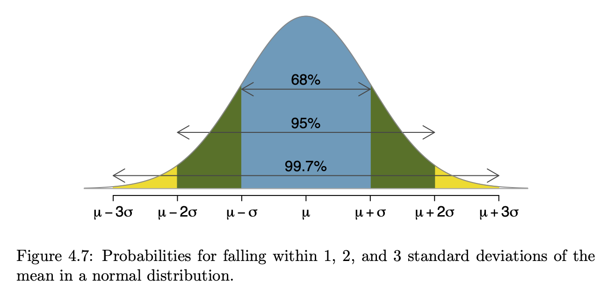 | 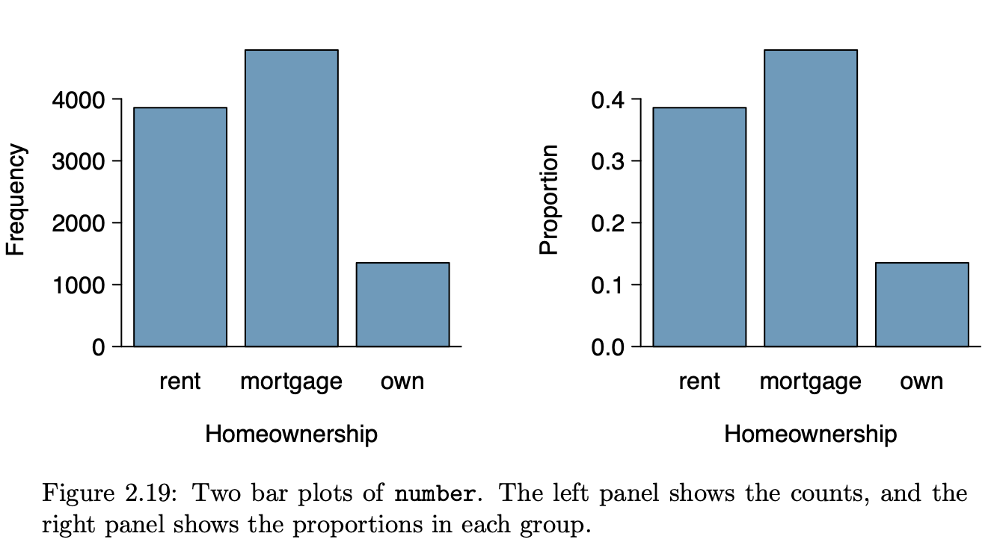
    | 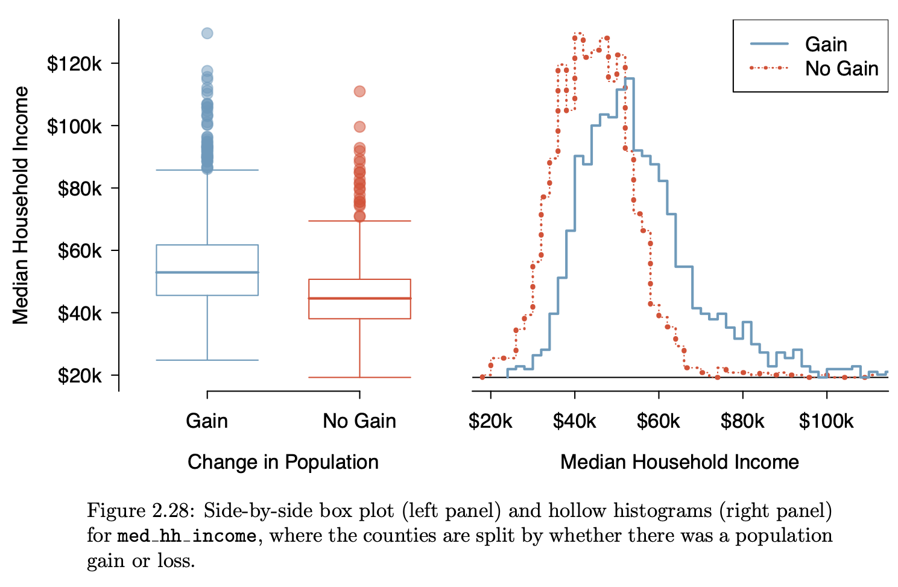
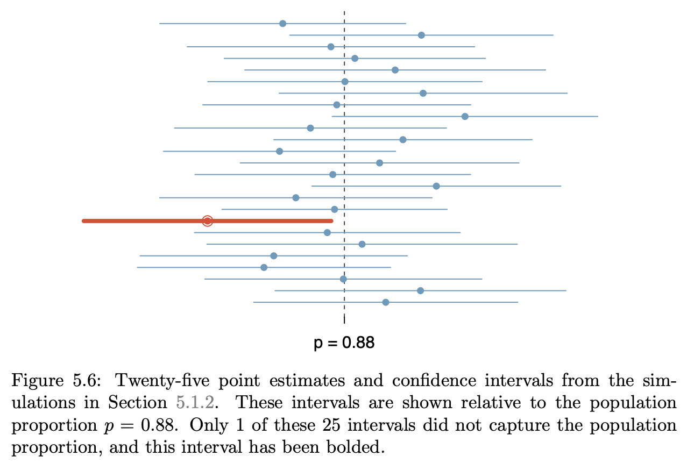          | 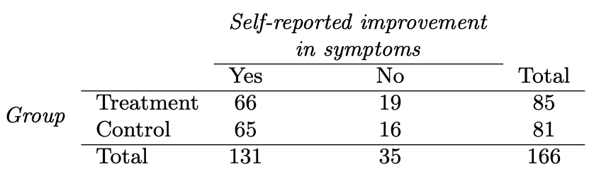
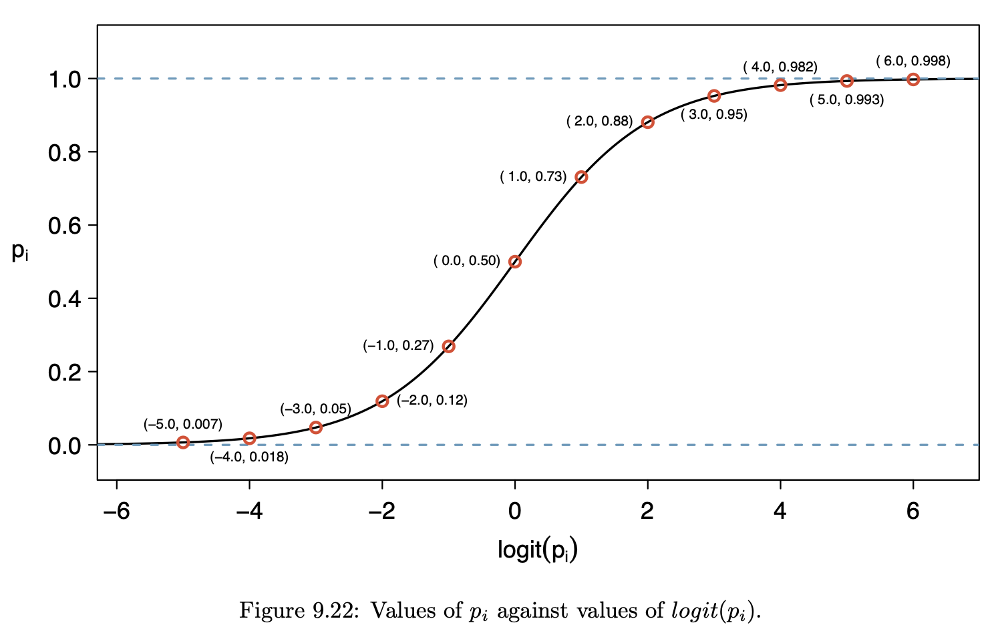        | 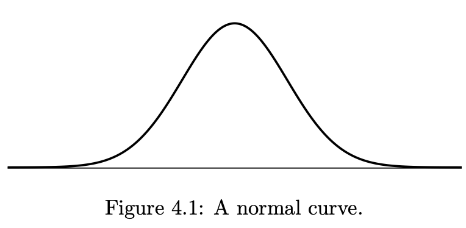
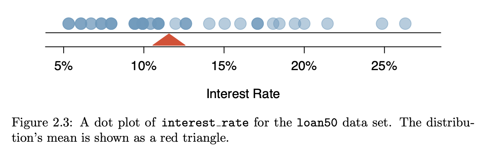           | 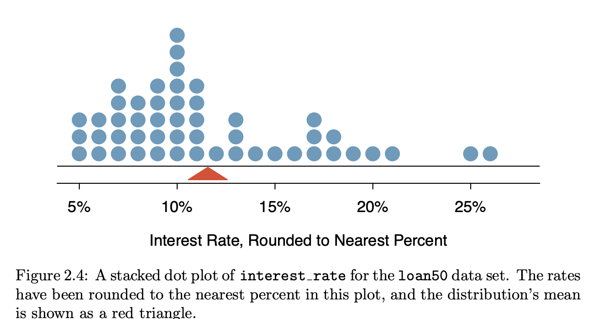
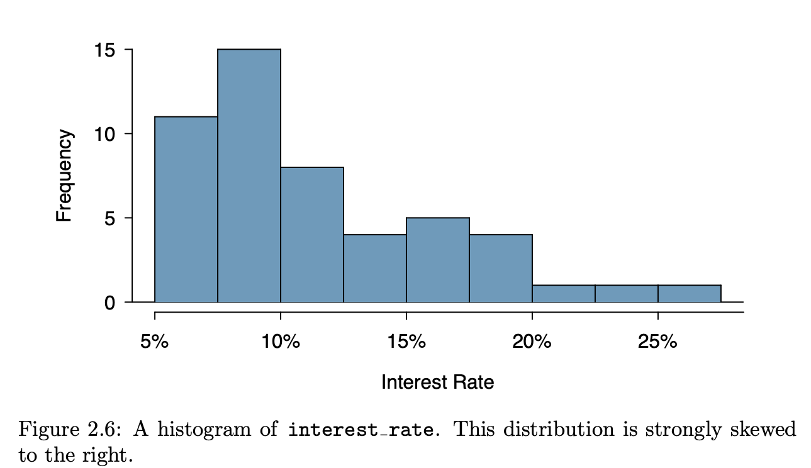               | 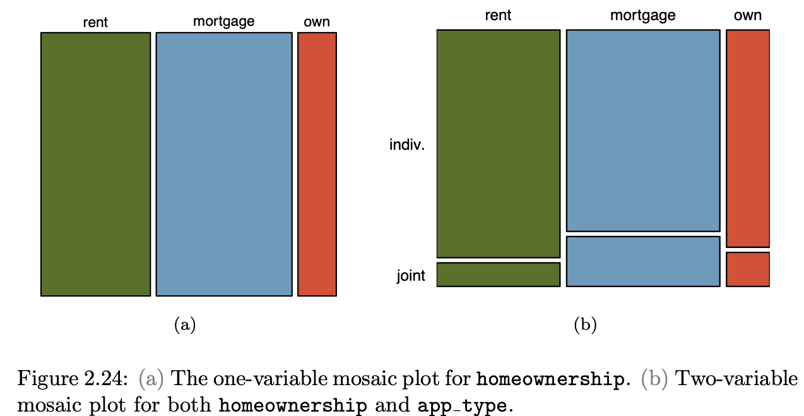
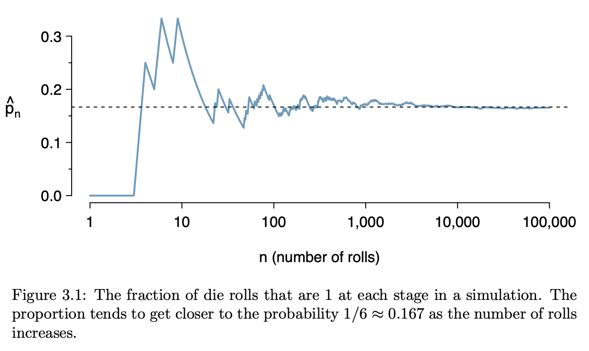          | 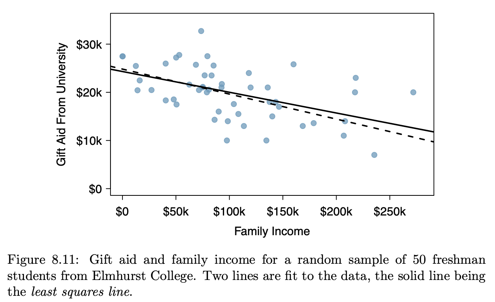
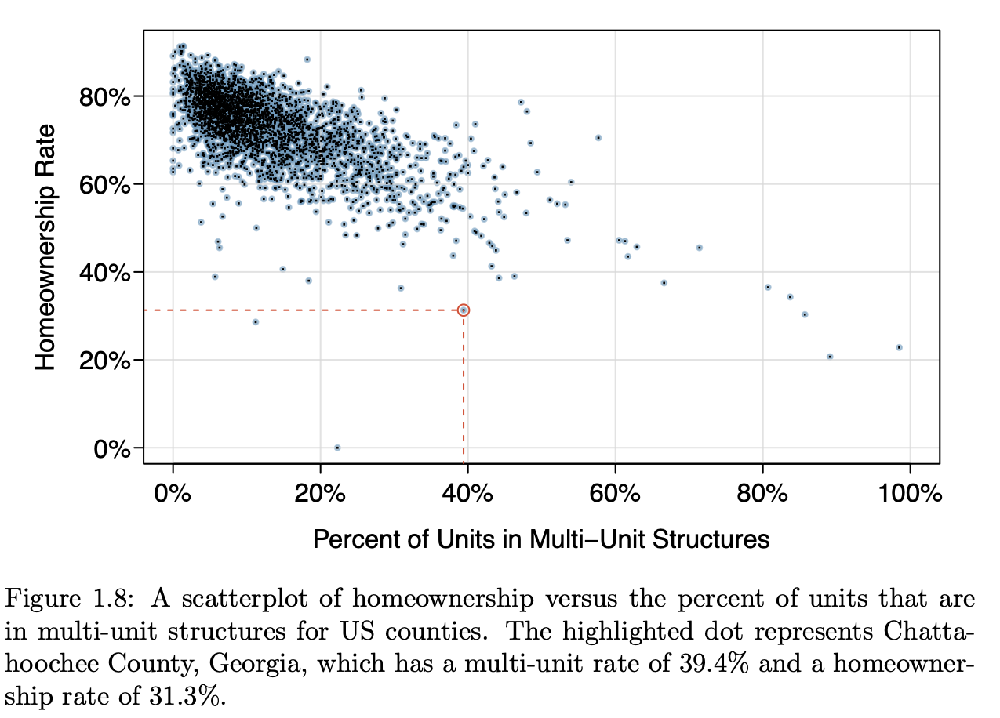       | 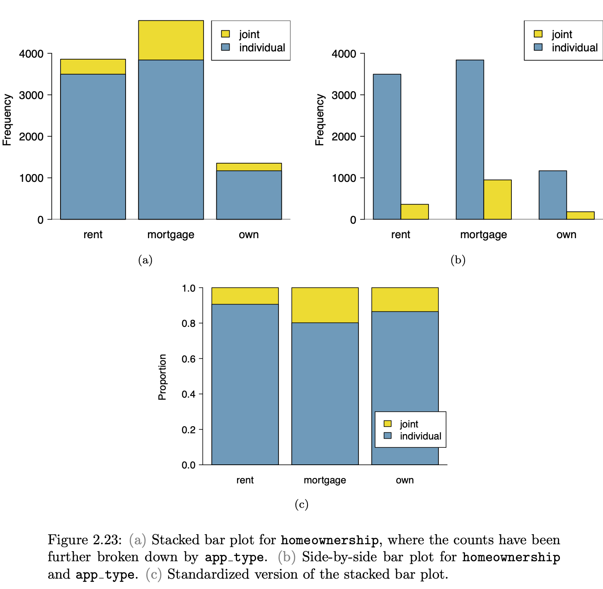
Not from Open Intro | Not from Open Intro
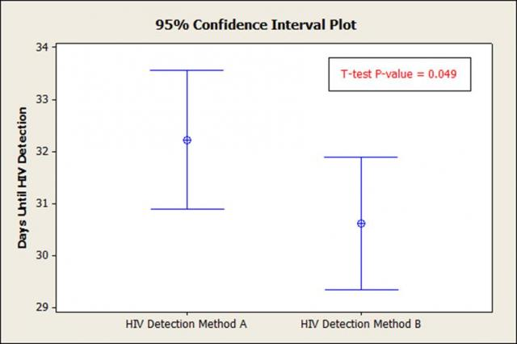 | 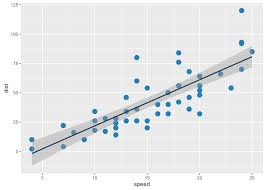

## A simplifying proposal

Let's reduce the number of graphical modes arranging things so ...

1. "Raw" data can be expected to be shown in a graphic.
2. Each axis is always a variable, and the y axis is  consistently used to display a response variable.
3. The kind of glyph unequivocally identifies what is being displayed.

```{r echo=FALSE}
NHANES <- NHANES::NHANES %>%
    select(Age, Height, HomeOwn, Depressed,
           Poverty, Work) %>%
    na.omit()
```

### Data Layer

* The frame is something  like this:

```{r}
gf_blank(Height ~ Age, data = NHANES)
gf_blank(Poverty ~ HomeOwn,  data = NHANES)
gf_blank(Depressed ~ Work,  data  = NHANES)
```

* Data is always plotted with a ✺
* Jittering and transparency are used to deal with overplotting.

```{r}
gf_point(Height ~ Age, data = NHANES,
         alpha = 0.3)
gf_jitter(HomeOwn ~ Poverty,  data = NHANES,
          alpha = 0.3, height = 0.2)
gf_jitter(Depressed ~ Work,  data  = NHANES,
          alpha = 0.1, width = 0.2, height = 0.2)
```

Adding in color and facetting, up to four variables can be shown, but relationships become progressively more difficult to read.

### Model layer

Glyph is a more-or-less horizontal line or curve
showing the model output at each value of the explanatory variables.

```{r}
mod1 <- lm(height ~ ns(mother,2) * sex,
           data = Galton)
mod_shape <- mod_eval(mod1,
                      mother = seq(55,72,length =  100),
                      interval = "prediction")
mod_shape2 <- mod_eval(mod1,
                      mother = seq(55,72,length =  100),
                      interval = "confidence")
gf_point(height ~ mother | sex,  data = Galton,
         alpha = 0.2) %>%
    gf_line(model_output ~  mother | sex, data =  mod_shape, size = 2)
```

### Interval layer

Glyph is either a ribbon or an I-bar.

```{r}
gf_point(height ~ mother | sex,  data = Galton,
         alpha = 0.2) %>%
    gf_ribbon(lower + upper ~  mother | sex,
              data =  mod_shape, alpha  = 0.2,
              inherit =  FALSE)
```

Note: In the context provided by the data, it's always clear whether a band is a prediction  interval or a confidence interval.

```{r}
gf_point(height ~ mother | sex,  data = Galton,
         alpha = 0.1) %>%
    gf_ribbon(lower + upper ~  mother | sex,
              data =  mod_shape2, alpha  = 0.4,
              inherit =  FALSE)
```

```{r}
mod <- lm(Height ~ Depressed, data = NHANES)
mod_shape <- mod_eval(mod, interval = "prediction")

```

Two distinct questions:

- **Prediction**:  Does knowing the mother's height meaningfully narrow a prediction of the adult child's height?
- **Description**: Is the mother's height connected  with the adult child's height?

### Density layer

The data points themselves indicate the joint probability density.

Use another glyph to show conditional density: a violin:

```{r}
gf_jitter(Poverty ~ Depressed,  data = NHANES,
          alpha = 0.03, width = 0.2) %>%
    gf_violin(alpha = 0.1, fill  = "black")

```

## EXERCISES:

- Is this a confidence interval or a prediction  interval.
- For which group is low weight more common  Weight ~ Smoker | Gender?
- Sketch out density violins.
- Which of these  tells the story  more clearly:
Hourly number of rentals versus Time of Day and Client type and Weekday or Hourly number of rentals versus Weekday, Time of Day  (color), and Client  type.

## Activity 2: Showing relationships

Each of the following settings shows n = 100 data points. The variables are shown on the axes and, sometimes, as the name of a color legend. For each of the settings, your task is to:

1. Describe the relationship depicted. Be as quantitative as one could expect  for an estimate *by eye*.
2. Give the name of the appropriate inferential technique.
    - Do you teach that technique in your introductory course.
    - If not, where might students encounter that technique.
3. Attempt to estimate, *by eye* and without whatever supplemental arithmetic is requires, the approximate values of the quantities produced by the technique in (2). For instance, is the relationship between the response and explanatory variables statistically discernable.^[Again, I'm using a proposed replacement for the traditional "significant."] 

### Setting A

```{r echo  = FALSE}
set.seed(101)
CPS <- CPS85 %>% filter(wage < 30) %>% sample_n(size  = 100) %>%
    mutate(sexF = as.numeric(sex == "F"),
           marriedY = as.numeric(married == "Married"))
```

```{r echo = FALSE}
resA <- make_model_plots(marriedY ~ sex, data = CPS, 
                         show_model = FALSE)
resA$P1 %>%
    gf_refine(
        scale_y_continuous(
            'Marital status', breaks  =  c(0, .25, .5, .75, 1), 
            labels = c("Single", .25,  .5, .75, "Married"),
            limits = c(-.1, 1.1)))
```

### Setting B

```{r echo = FALSE}
resB  <- make_model_plots(wage ~ union, data = CPS,
                       show_model = FALSE,
                       sd  =  TRUE, R2 = TRUE,
                       F = TRUE)
resB$P1
```

### Setting C

```{r echo = FALSE}
resC  <- make_model_plots(marriedY ~ age, data = CPS,
                       show_model = FALSE,
                       sd  =  TRUE, R2 = TRUE,
                       F = TRUE)
resC$P1  %>%
    gf_refine(
        scale_y_continuous(
            'Marital status', 
            breaks  =  c(0, .25, .5, .75, 1), 
            labels = c("Single", .25, .5, .75, "Married"), 
            limits = c(-.1, 1.1)))
```

### Setting D

```{r echo = FALSE}
resD  <- make_model_plots(wage ~ educ, data = CPS,
                       show_model = FALSE,
                       sd  =  TRUE, R2 = TRUE,
                       F = TRUE)
resD$P1 
```

### Setting E

```{r echo = FALSE}
resE  <- make_model_plots(marriedY ~ ns(age,3) * sex, data = CPS,
                       show_model = FALSE,
                       sd  =  TRUE, R2 = TRUE,
                       F = TRUE)
resE$P1  %>%
    gf_refine(
        scale_y_continuous(
            'Marital status', 
            breaks  =  c(0, .25, .5, .75, 1), 
            labels = c("Single", .25, .5, .75, "Married"), 
            limits = c(-.1, 1.1)))
```

### Setting F

```{r echo = FALSE}
resF  <- make_model_plots(wage ~ educ* sex, data = CPS,
                       show_model = FALSE,
                       sd  =  TRUE, R2 = TRUE,
                       F = TRUE)
resF$P1 
```

### Setting G

```{r echo = FALSE}
resG <- make_model_plots(marriedY ~ sex  *  union, data = CPS, 
                         show_model = FALSE)
resG$P1 %>%
    gf_refine(
        scale_y_continuous(
            'Marital status', breaks  =  c(0, .25, .5, .75, 1), 
            labels = c("Single", .25,  .5, .75, "Married"),
            limits = c(-.1, 1.1)))
```


### Setting H

```{r echo = FALSE}
resH <- make_model_plots(marriedY ~ sector, data = CPS, 
                         show_model = FALSE)
resH$P1 %>%
    gf_refine(
        scale_y_continuous(
            'Marital status', breaks  =  c(0, .25, .5, .75, 1), 
            labels = c("Single", .25,  .5, .75, "Married"),
            limits = c(-.1, 1.1)))
```

### Setting EYE

```{r echo = FALSE}
resI <- make_model_plots(wage ~ sector, data = CPS, 
                         show_model = FALSE)
resI$P1 
```

### Setting J

```{r echo = FALSE}
resJ <- make_model_plots(wage ~ sector  *  educ, data = CPS, 
                         show_model = FALSE)
resJ$P1 
```


