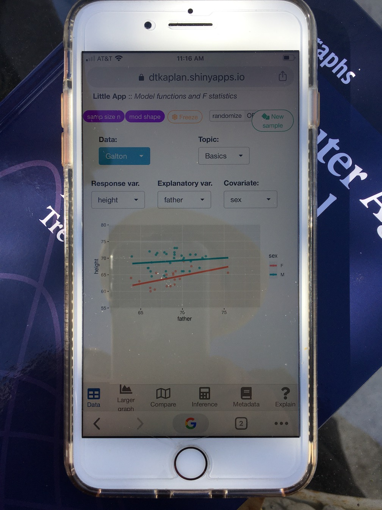
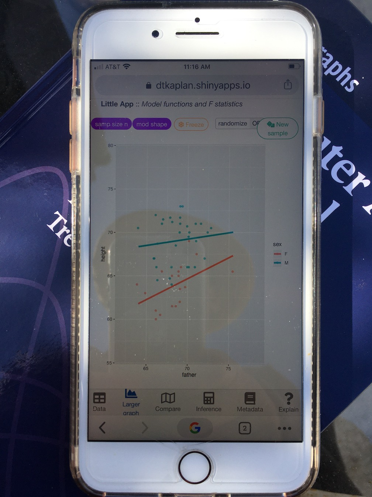

--- 
title: "Stats for Data Science"
author: "Daniel Kaplan"
date: "`r Sys.Date()`"
site: bookdown::bookdown_site
output: bookdown::gitbook
documentclass: book
bibliography: []
biblio-style: apalike
link-citations: yes
github-repo: dtkaplan/jmm2020
description: "Notes for the JMM 2020 workshop."
---

# Orientation {-}

These are notes for the MAA sponsored minicourse *Stats for Data Science* at the 2020 Joint Mathematics Meetings in Denver, Colorado.

- Part A, Thursday, 1:00 –3:00 pm 
- Part B, Saturday, 1:00–3:00 pm. 

## Objective {-}

I start with the presumption that you are interested in **teaching data science** and trying to sort out the possible relationship between **introductory-level statistics** and data science.

My objective is to provide

* A complete outline of a plausible introductory course that genuinely engages data science while honestly covering core statistical topics in a statistical way.
    - For practical reasons of time, I'll emphasize the **new** elements and not topics that can be carried over from an existing course like sampling bias, random assignment, etc.
    - Also, for reasons of time, I'll focus only on the statistical concepts and methods and not on data-science topics such as wrangling, cleaning, etc.

* Put you in a position where you can teach such a course starting, let's say, next fall.
    - Not requiring you to master extensive new computational skills.
    - Connected to many of the statistical topics you teach now ... but considering which of those topics add genuine value and disregarding those that are merely included by tradition.
    
## The new elements ... {-}

1. **Streamline visualization**. Adopt contemporary graphical modalities and by-pass the catalog of traditional formats. (15 minutes of this 4-hour mini-course)

    This frees up time in the your course, puts data at the center rather than theory, and avoids student confusion about why a particular style of graph is being used.
    
2. Consistently use **functions** and **effect sizes** to describe relationships. (30 minutes of this 4-hour mini-course)

    The functions will have the form $y = f(x, z)$ where
    - $y$ is the response variable
    - $x$ and $z$ are explanatory variables.
    - $z$ plays the role of a **covariate**, that is, a variable not of direct interest that may color the observed relationship between $x$ and $y$.
        
    Effect sizes are slopes and differences. For this mathematically sophisticated audience, I'll describe them as partial derivatives and partial differences:
    - $\partial y / \partial x$ for continuous $x$
    - $\Delta y$ for categorical $x$
        
    I will treat model fitting as a calculator function: something that happens automatically once the inputs are provided.
    
3. **Generalize inference** which allows the presentation to be streamlined and simplified and, at the same time, to be extended to settings not usually touched on in an introductory course. (30 minutes of this 4-hour mini-course)

    - Ignore theoretical niceties that are of questionable utility or validity in real work, e.g.
        - ~~one-tailed tests~~ 
        - ~~unequal variance tests~~
        
    - All inference will be about models and effect sizes. No methods, such  as chi-squared, which produce only a p-value without an indication of the magnitude of the relationship.

    - Pay heed to how much  precision is actually needed in a result. For instance there's no good reason to suggest that a p-value is meaningful past the second digit. So bypass calculations that worry about the third digit.

4. Embrace **causal reasoning** from observational data. Teach students how to draw and recognize *responsible* conclusions about causation. (30 minutes)

5. Integrate statistical findings with real-world **decision making**. 
    -  ~~reject the null?~~
    - cost functions
    - trade-offs
    - using statistical results in the context of larger  frameworks.

## Computing {-}

I want to put aside the question of how much computing should be taught in (or before) introductory statistics.^[In my own courses I strongly emphasize technical computing and  professional workflows.] Instead, I'll focus on teaching a course using only:

- paper and pencil estimation and calculation
- no-coding web apps that make detailed graphics and do precise calculations

(ref:phone-app-cap) Drawing graphics, model fitting, and statistical calculations can be carried out using a point-and-click web app. This is displayed in a regular browser window and can be plausibly used with a smart phone. We'll  use this app later in  the mini-course.

```{r phone-app, echo=FALSE, out.width = "45%", fig.show = 'hold', fig.cap = "(ref:phone-app-cap)"}

#
```


## JMM 2020 Abstract {-}

As universities and colleges rush to offer courses and even degree programs in data science, it's fair to wonder whether data science is genuinely new or is merely a rebranding of statistics. This mini-course will introduce participants to important and substantial ways that a statistics course that genuinely engages data science differs from traditional statistics.These include an emphasis on prediction, classification and causality rather than the traditional focus on estimation and significance. During the mini-course, we'll work through both theoretical and computational exercises from a new book, Stats for Data Science (available at https://dtkaplan.github.io/SDS-book/preface.html). The workshop is appropriate for anyone from a newcomer to statistical computing to experts. Some small groups in the mini-course will choose to use mouse-driven "Little Apps" to display data-science oriented statistical concepts. Others will choose to work with interactive R tutorials based on modern modeling and graphics packages in R. Participants should bring a laptop or tablet. All work will be browser based; there's no need to install new software.

## Resources {-}

- Participant notes, comments, suggestions, questions, etc. 
- Participant introductions
- Books
    - [*Stats for Data Science*](http://dtkaplan.github.io/SDS-book) textbook. The link is to the current draft of a textbook I am writing to explore how statistics can be taught in a way that genuinely embraces the typical goals of data-science practice.
    - *[A Compact Guide to Classical Inference](http://dtkaplan/github.io/CompactInference/private)* by Daniel Kaplan. This book deals with one small but important part making a mental and teaching transition from a conventional intro stat course into a course suitable for data science. In particular, the *Compact Guide* approaches statistical description using model functions and, with this basis, unifies and simplifies the inferential settings typically covered in inferential stats. All those traditional settings--difference of means and of proportions, simple regression, inference on contingency tables, one-way analysis of variance, two-way analysis of variance, multiple regression--are translated into a single test statistic, F, with a simple formula and simple interpretations. For instance, statistical "significance"^[Recently, Jeff Witmer at Oberlin College suggested replacing the misleading technical use of an everyday word with an utterly different meaning: significance. His suggestion is "discernible" and "discernibility", as in "the difference is statistically *discernible*" or "one part of inference is statistical *discernibility*".] is addressed by the simple question, is $F > 4$. Confidence intervals on differences and slopes are all shown to have the same form, proportional to $1 \pm \sqrt{4 / F}$.
    - *[Statistical Inference via Data Science](http://moderndive.com/)* by Chester Ismay and Albert Y. Kim. For the introductory-course instructor who is not shy of using R with her class and who wants to touch on non-statistical aspects of data science such as data wrangling, this can be good choice for a textbook. The statistical topics are conventional, but the book wisely leaves the mean-median-mode stuff for an appendix. In the sense that the presentation of statistics is based on regression, I see this book as a kind updating for data science and recent developments in R of *Statistical Modeling*. (See next entry). *Statistical Inference* is not as radical as *Stats for Data Science*, but for many instructors that's probably a good thing. There are exercises ("learning checks") and solutions.
    - *[Statistical Modeling: A Fresh Approach](https://dtkaplan.github.io/SM2-bookdown/introduction.html)* by Daniel Kaplan was my attempt, circa 2010, to re-imagine what can be done in an introductory statistics course to make the course more relevant to genuine practice, take confounding seriously, and provide room for student creativity in framing statistical questions. So, instead of "do I use t or chi-squared?" the question becomes "what covariates are relevant and what are the implications of including them in a statistical analysis?"
    - *[Computer Age Statistical Inference](https://web.stanford.edu/~hastie/CASI_files/PDF/casi.pdf) by Bradley Efron and Trevor Hastie. This is a concise review of classical statistical inference that is much broader than the *Compact Guide* and particularly oriented to deep theoretical limitations of classical inference and a couple of generations of work to overcome those limitations.
    - *[The Book of Why](https://www.amazon.com/Book-Why-Science-Cause-Effect/dp/046509760X)* by Judea Pearl and Dana Mackenzie. This is a fantastic introduction to causal inference which, yes, does go beyond the pat "correlation is not causation" or "no causation without experimentation."
    - *[The Theory that Would not Die](https://www.amazon.com/Theory-That-Would-Not-Die-ebook/dp/B0050QB3EQ)* by Sharon Bertsch McGrayne. The subtitle is "How Bayes' Rule Cracked the Enigma Code, Hunted Down Russian Submarines, and Emerged Triumphant from Two Centuries of Controversy" which aptly describe the book's historical approach. This isn't a textbook, but it is a good way to see why Bayes is important.
    - *[Modern Data Science with R](https://mdsr-book.github.io/)* by Ben Baumer, Daniel Kaplan, and Nicholas Horton. This book covers a wide range of data science techniques, but wouldn't be suitable for a *statistics* course.
    - *[R for Data Science](https://r4ds.had.co.nz/)* by Garrett Golemund and Hadley Wickham. Like *Modern Data Science with R*, it's not a suitable book for a statistics course. But it's an excellent (even canonical) choice to make sense of the recent generation of R data-science tools.
    
- Little Apps. These are web-based apps that provide statistical computing capabilities *without coding*. There are, of course, many other apps provided to the stat-ed community such as the Lock^5^ [StatKey](http://www.lock5stat.com/StatKey/index.html) collections and Dan Adrian's [Happy Apps](http://statprep.org/1204-2/#more-1204). 
    1. [Functions and F statistics](http://dtkaplan.shinyapps.io/LittleAppMockup). This is the Little App written specifically for the *Compact Guide*. It also happens to be the prototype for the next generation of Little Apps that are mobile-device ready.
    2. [Regression models](https://dtkaplan.shinyapps.io/LA_linear_regression/) is a pre-cursor to the *Functions and F statistics* Little App. It explains the idea of *model values*, which  are simply the values of a statistical model evaluated using the training data as input.
    3. [Resampling and Bootstrapping](https://dtkaplan.shinyapps.io/LA_bootstrap/) demonstrates these ideas graphically.
    4. A few other Little Apps, developed as part of <StatPREP.org>, cover topics of the traditional intro course such as [t-tests](https://dtkaplan.shinyapps.io/LA_t_test/), the [normal distribution](https://dtkaplan.shinyapps.io/LA_rare_and_common/) and [center and spread](https://dtkaplan.shinyapps.io/LA_center_spread/).
- Computing tutorials
    1. GET THE LIST FROM STATPREP.org. MAYBE WRITE ONE FOR THE COMPACT GUIDE?
    
